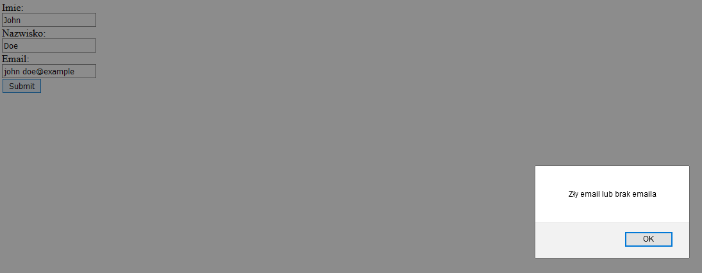

# Math website
>This is a set of javascript mathematical calculation scripts presented as a simple html website. It has been written as an assignment for my university.

## Table of Contents
* [General Info](#general-information)
* [Technologies Used](#technologies-used)
* [Features](#features)
* [Screenshots](#screenshots)
* [Setup](#setup)
* [Project Status](#project-status)
* [Room for Improvement](#room-for-improvement)
* [Contact](#contact)

## General Information
The website was written in html/CSS and javascript. From the menu you can acces 3 types of calculation forms and view a log in form.

## Technologies Used

- HTML 5

- CSS

- Javascript 1.5

- Visual Studio Code 1.55.2

## Features
List the ready features here:
- A simple menu
- Finding the maximum number in a series
- Calculating an element of the fibonacci sequence
- Finding the largest common denominator of 2 intigers
- A log in form with an automatic syntax checking and basic autocorrection

## Screenshots

**The menu**

**Calculate maximum**

**Calculate an element of the fibonacci sequence**

**Find the largest common denominator**

**The log in form with syntax check**

## Setup
You can open the index.html file with any web browser to view the website,
or edit the files in an editor of your choice (for example: Visual Studio Code)

## Project Status
The project is completed and no longer worked on as it's purpose was strictly educational.

## Room for Improvement
### Areas, which could be improved/expanded

- Inclusion of additional mathematical scripts

- Full english translation

- Fibonacci sequence calculation time

- General optimization

## Contact
Created by [@flynerdpl](https://www.flynerd.pl/) - feel free to contact me!
